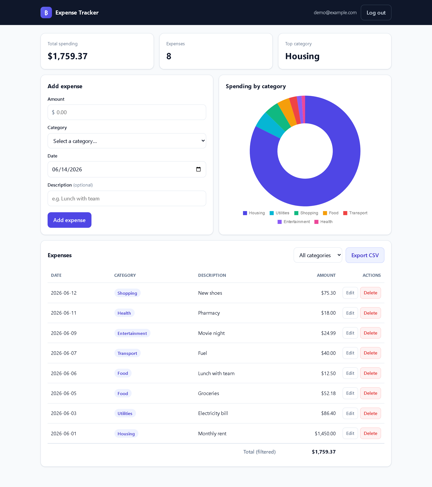
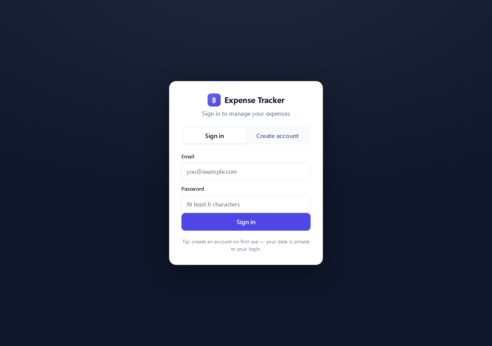
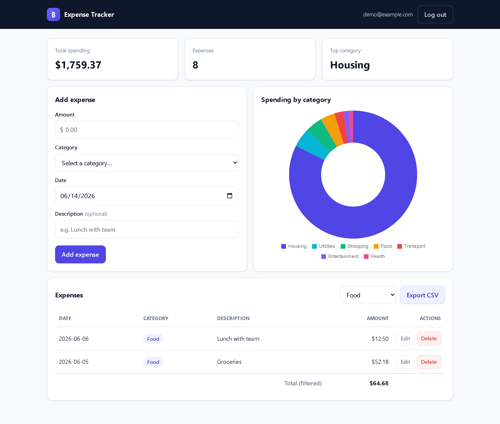
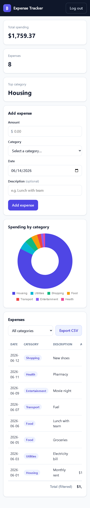

# Personal Expense Tracker

A simple, responsive web app for tracking daily expenses. Add, edit, delete and
filter expenses; see your total spending and a category breakdown chart; export
everything to CSV. Each user has their own private, password-protected account.

Built with **Node.js + Express** and **SQLite** (via Node's built-in
`node:sqlite` module — no native build step). The frontend is plain
**HTML / CSS / JavaScript** with **Chart.js** for visualizations.

### Live demo / linking from your site
This is a full-stack app (Node backend), so it **cannot run on GitHub Pages**
(static-only). Deploy it to a host once, then link to that URL from your website.
One-click deploy:

[](https://render.com/deploy?repo=https://github.com/aphrodi-ul/personal-expense)

After it deploys you'll get a URL like `https://personal-expense.onrender.com` —
put that in a link on your site:
`<a href="https://personal-expense.onrender.com">Open Expense Tracker</a>`

---

## Features

**Core**
- Add transactions with **amount, category, description, date**
- **REST API**: create, read, update, delete
- View everything in a **responsive, sortable table**
- **Filter** by category, type, **date range** (this month / 30 days / year / custom) and **search**
- **Totals** — expenses, income, net balance, average/day, biggest expense
- **Input validation** on both client and server

**Money management**
- 💸 **Income tracking & net balance** — log income alongside expenses
- 🎯 **Per-category budgets** — monthly limits with progress bars and over-budget alerts
- 🔁 **Recurring transactions** — auto-generated each month (e.g. rent, salary)
- 🏷️ **Custom categories** — add/remove your own

**Data & UX**
- 🔐 **User authentication** — register / login with JWT, bcrypt-hashed passwords
- 📊 **Charts** — spending-by-category doughnut + monthly income/expense trend (Chart.js)
- 📁 **CSV export & import** — download a filtered set or bulk-add from CSV
- 🧾 **Receipt images** — attach a photo to any transaction
- 🌙 **Dark mode**, 🖨️ **print / save-as-PDF** report
- ⚙️ **Account settings** — change password, export all data, delete account

---

## Screenshots

| Dashboard | Login / register |
|-----------|------------------|
|  |  |

| Filter by category | Mobile (responsive) |
|--------------------|---------------------|
|  |  |

> Screenshots are regenerated with `node scripts/uitest.js` / `node scripts/screenshots.js`
> (requires Chrome; see each script header). Some may lag behind the latest UI.

---

## Tech stack

| Layer     | Choice                                             |
|-----------|----------------------------------------------------|
| Backend   | Node.js, Express                                   |
| Database  | SQLite (`node:sqlite`, bundled with Node ≥ 22.5)   |
| Auth      | JWT (`jsonwebtoken`), password hashing (`bcryptjs`)|
| Frontend  | HTML, CSS, vanilla JS, Chart.js (via CDN)          |

There are only three runtime dependencies and **no native modules**, so
`npm install` is fast and reliable on any platform.

---

## Getting started

### Prerequisites
- **Node.js ≥ 22.5** (uses the built-in `node:sqlite` module). Check with `node --version`.

### Install & run
```bash
# from the personal-expense-tracker folder
npm install
npm start
```

Then open **http://localhost:3000** in your browser.

On first use, click **Create account**, register with an email + password, and
start adding expenses.

> The SQLite database file (`data.db`) is created automatically on first run.

### Configuration (optional)
The app runs with sensible defaults. To override, copy `.env.example` to `.env`
or set environment variables:

| Variable     | Default        | Description                         |
|--------------|----------------|-------------------------------------|
| `PORT`       | `3000`         | Port the server listens on          |
| `JWT_SECRET` | `dev-secret…`  | Secret for signing tokens (change in production) |
| `DB_PATH`    | `./data.db`    | SQLite database file path           |

> Note: `.env` is not auto-loaded (no extra dependency). Set the variables in
> your shell, e.g. `PORT=4000 npm start`, or hard-set them in your environment.

---

## API reference

All `/api/expenses` endpoints require an `Authorization: Bearer <token>` header.
Obtain a token from `/api/auth/login` or `/api/auth/register`.

### Auth
| Method | Endpoint             | Body                         | Description            |
|--------|----------------------|------------------------------|------------------------|
| POST   | `/api/auth/register` | `{ email, password }`        | Create account, returns token |
| POST   | `/api/auth/login`    | `{ email, password }`        | Log in, returns token  |

### Expenses
| Method | Endpoint                       | Description                              |
|--------|--------------------------------|------------------------------------------|
| GET    | `/api/expenses`                | List all (optional `?category=Food`)     |
| GET    | `/api/expenses/summary`        | Totals + per-category breakdown          |
| GET    | `/api/expenses/export`         | Download all expenses as CSV             |
| POST   | `/api/expenses`                | Create `{ amount, category, date, description? }` |
| PUT    | `/api/expenses/:id`            | Update an expense                        |
| DELETE | `/api/expenses/:id`            | Delete an expense                        |

### Example
```bash
# Register and capture the token
TOKEN=$(curl -s -X POST http://localhost:3000/api/auth/register \
  -H 'Content-Type: application/json' \
  -d '{"email":"demo@example.com","password":"secret123"}' | node -pe 'JSON.parse(require("fs").readFileSync(0)).token')

# Create an expense
curl -X POST http://localhost:3000/api/expenses \
  -H "Authorization: Bearer $TOKEN" \
  -H 'Content-Type: application/json' \
  -d '{"amount":12.50,"category":"Food","date":"2026-06-14","description":"Lunch"}'

# List expenses
curl http://localhost:3000/api/expenses -H "Authorization: Bearer $TOKEN"
```

---

## Project structure
```
personal-expense-tracker/
├── server/
│   ├── index.js            # Express app + route wiring + error handling
│   ├── config.js           # Env-driven config with defaults
│   ├── db.js               # SQLite connection + schema
│   ├── middleware/
│   │   └── auth.js         # JWT verification middleware
│   └── routes/
│       ├── auth.js         # register / login
│       └── expenses.js     # CRUD + summary + CSV export
├── public/                 # Static frontend (served by Express)
│   ├── index.html          # Main app
│   ├── login.html          # Login / register
│   ├── css/styles.css
│   └── js/
│       ├── api.js          # fetch wrapper with auth handling
│       ├── auth.js         # login/register page logic
│       └── app.js          # main app logic + Chart.js
├── package.json
├── .env.example
└── README.md
```

---

## Design notes

- **Security**: passwords are hashed with bcrypt; API access is gated by JWT.
  Every expense query is scoped to the authenticated `user_id`, so users can
  only see and modify their own data.
- **Validation & errors**: the server validates every payload and returns clear
  `4xx` JSON errors; a central error handler catches the rest. The frontend
  mirrors validation for instant feedback.
- **No build step**: vanilla frontend + CDN Chart.js means there's nothing to
  compile — just `npm install && npm start`.

## Deployment

The repo ships with both a **Dockerfile** (any container host) and a **Render
Blueprint** (`render.yaml`). In all cases, set a strong `JWT_SECRET` and point
`DB_PATH` at **persistent storage** — otherwise the SQLite file is wiped on each
redeploy/restart.

> Requires a Node ≥ 22.5 runtime. The provided configs pin **Node 24**, where
> `node:sqlite` is built in and needs no flags.

### Option A — Render (one click via Blueprint) — FREE
1. Push this repo to GitHub (already done).
2. On [Render](https://render.com): **New → Blueprint**, select the repo (or use the
   Deploy button at the top). It reads `render.yaml`, provisions a **free** web
   service, and **auto-generates `JWT_SECRET`**.
3. Deploy. Your app is live at `https://<service>.onrender.com` — link to that from
   your website.

> **Free plan caveats:** the service sleeps after ~15 min idle (first visit then
> takes ~30–50s to wake), and has no persistent disk, so the SQLite database
> **resets on restart**. Fine for a demo.
>
> **Want durable data?** Use `render.persistent.yaml` (adds a 1 GB disk, requires
> a paid Starter plan). Render only reads a file named `render.yaml`, so rename it
> first: `git mv render.persistent.yaml render.yaml`.

### Option B — Docker (Railway, Fly.io, Cloud Run, a VPS, …)
```bash
docker build -t expense-tracker .
docker run -p 3000:3000 \
  -e JWT_SECRET="$(openssl rand -hex 32)" \
  -e DB_PATH=/data/data.db \
  -v expense_data:/data \
  expense-tracker
```
The named volume (`-v expense_data:/data`) keeps your data across container
restarts. On Railway/Fly, attach a volume mounted at `/data` and set the same
env vars in the dashboard.

### Required environment variables
| Variable     | Required | Notes                                            |
|--------------|----------|--------------------------------------------------|
| `JWT_SECRET` | **Yes**  | Long random string; signs auth tokens            |
| `DB_PATH`    | **Yes**  | Path on a persistent volume (e.g. `/data/data.db`) |
| `PORT`       | No       | Set automatically by most hosts                  |

## Possible next steps
- Date-range filtering and monthly trend (bar/line) chart
- Editable categories / budgets per category
- Pagination for large datasets
- Swap SQLite for Postgres if multi-instance horizontal scaling is needed

## License
MIT
